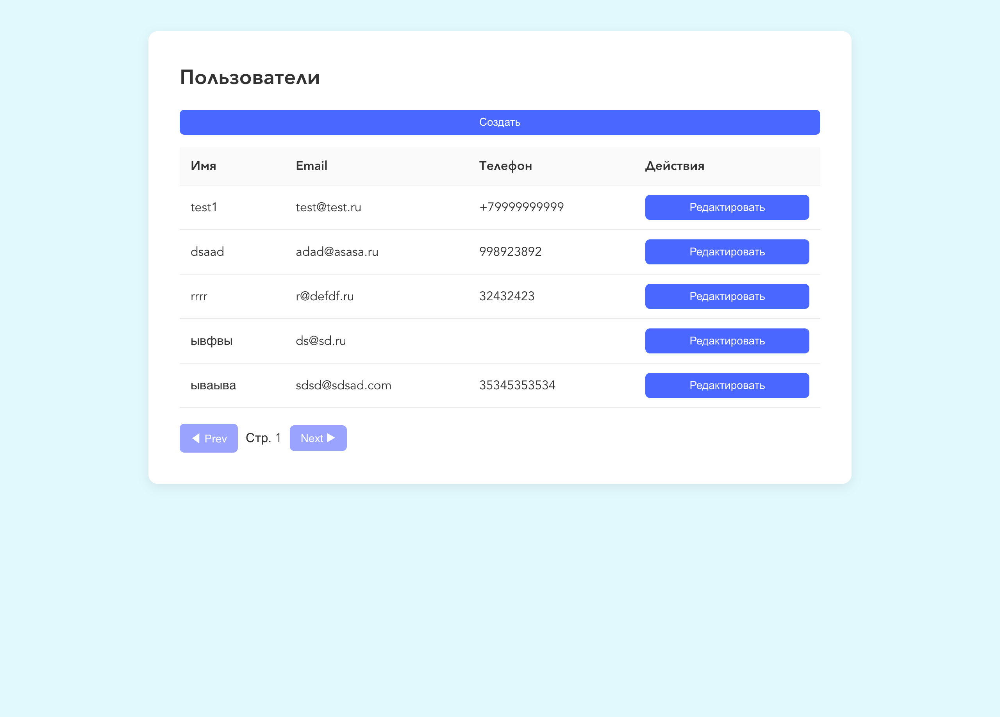

# Users Manager Frontend

[Ссылка на деплой на Vercel](https://users-manager-theta.vercel.app/)

**Users Manager** — это тестовое приложение для управления пользователями: просмотр, добавление, редактирование и удаление.
Проект реализован на **React + TypeScript + Redux Toolkit**, с использованием **MockAPI.io** для хранения данных.



---

## Функционал

- Просмотр списка пользователей в таблице с пагинацией
- Открытие модального окна для создания нового пользователя
- Редактирование существующего пользователя в модальном окне
- Просмотр детальной информации о пользователе на отдельной странице
- Удаление пользователя
- Обработка ошибок с отображением в интерфейсе
- Адаптивный интерфейс

---

## Используемые технологии

| Технология                 | Назначение                                     |
| -------------------------- | ---------------------------------------------- |
| **React**                  | Компонентный UI-фреймворк                      |
| **TypeScript**             | Строгая типизация и стабильность кода          |
| **Redux Toolkit**          | Управление состоянием и асинхронными запросами |
| **Axios**                  | Выполнение HTTP-запросов                       |
| **react-router-dom**       | Навигация между страницами                     |
| **Material UI / Tailwind** | Быстрая стилизация и готовые компоненты        |

---

## API

Приложение использует сервис **[MockAPI.io](https://mockapi.io/)** для хранения данных пользователей.
Все пользователи хранятся по адресу (пример):

```
https://69176682a7a34288a280a15d.mockapi.io/users
```

> API поддерживает операции **GET**, **POST**, **PUT**, **DELETE**, поэтому изменения сохраняются и отображаются в интерфейсе.

---

## 🖥️ Установка и запуск

1. **Клонируйте репозиторий:**

```bash
git clone https://github.com/Yaroslav-Chertov/users-manager.git
cd users-manager
```

2. **Установите зависимости:**

```bash
npm install
```

3. **Запустите проект в режиме разработки:**

```bash
npm start
```

4. **Откройте в браузере:**

```
http://localhost:3000
```

---

## Структура проекта

```
src/
 ├─ app/                     # Redux store и хуки
 ├─ features/
 │   └─ users/
 │       ├─ components/      # Модалки и UI-компоненты
 │       └─ usersSlice.ts    # Redux slice и async thunks
 ├─ App.tsx                  # Главный компонент приложения
 ├─ index.css                # Глобальные стили
 └─ index.tsx                # Точка входа
```

---

## 🌟 Возможные улучшения

- 🔍 Реализовать фильтрацию и сортировку пользователей
- 📑 Добавить более продвинутую пагинацию
- 🧱 Подключить собственный backend для хранения данных
- 🎨 Улучшить UX/UI по полноценному дизайн-макету
